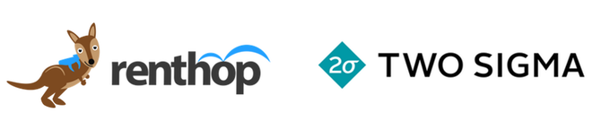
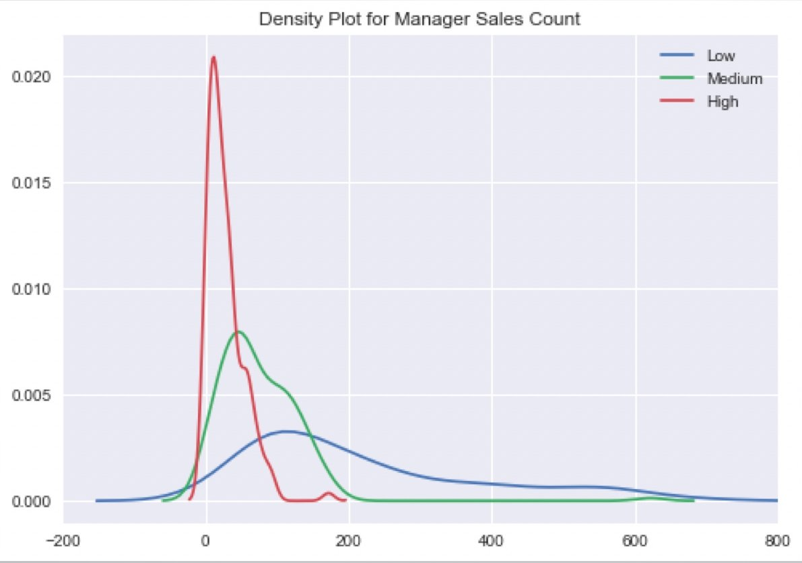

# Two Sigma RentHop Competition

---

# Agenda

1. Understanding the Data
2. Understand the Metric
3. Cross-Validate Early!
4. Hyperparameter Tuning

Source: [Winning Tips on Machine Learning Competitions by Kazanova](https://www.hackerearth.com/practice/machine-learning/advanced-techniques/winning-tips-machine-learning-competitions-kazanova-current-kaggle-3/tutorial/)

---
# Understanding the Data



Goal: "predict how popular an apartment rental listing is based on the listing content like **text description**, **photos**, number of bedrooms, price, etc."

Training: 49352 Rows
Test: 74659 Rows

78.5GB (compressed) of images barely anyone used

---

#Understand the Metric

Multiclass Log Loss (Low, Medium, High Interest)

$$log loss = -\frac{1}{N}\sum_{i=1}^N\sum_{j=1}^My_{ij}\log(p_{ij})$$

---
## What Actually Mattered

Manager ID Count



Someone just used different transformations of Manager ID Count and scored in the top 15%

Source: [Renthop Kaggle Competition: Team Null](https://blog.nycdatascience.com/student-works/renthop-kaggle-competition-team-null/)

---
## What Actually Mattered

Data Leak


---
## Second Place Solution

@Faron

```
- 32 LightGBM models
- 9 Extreme Tree models (sklearn)
- 7 RF models (sklearn)
- 5 Keras models
- 3 XGBoost models
- @KazAnova's StackNet example base-level predictions
```

Sidenote: LightGBM seems to be the new model of choice.
Best Model: LightGBM (CV: 0.50135/ Test: 0.50557)

Meta-modeled with a 2-layer neural network.

---
## Second Place Solution
Grid-Search Bagging

Grid Search: Check cross-validation scores for each hyperparameter
in regular intervals.
    e.g. Check maximum depth of XGBoost from 1 to 10.

Bagging (Bootstrap AGGregating): Sample the data many times, with
replacement

Grid-Search Bagging

For each of 12 bags:
    Grid search hyperparameters
    If the new hyperparameters is better, blend it into the model
---


