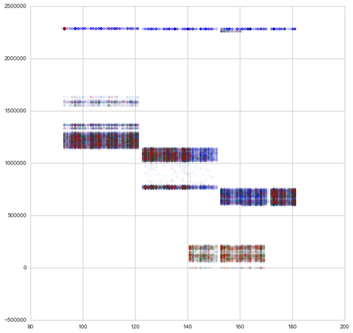

# Two Sigma RentHop Competition

Matthew Emery

June 1st, 2017

---
# Who are Two Sigma and RentHop?

 - Two Sigma: AI Heavy New York Hedge Fund
 - RentHop: Smart Apartment Search (New York Only)
 - Reward: Recruitment to Two Sigma


[Source](https://www.glassdoor.com/Salary/Two-Sigma-Salaries-E241045.htm)

---
# The Goal

 - Predict how interested people will be in this:


 - There are three classes (Low/Medium/High Interest)

---
# Understanding the Data


Training: 49352 Rows
Test: 74659 Rows

 - Location Data
 - Natural Language Data
 - Image Data (78.5 Gb compressed)
 - ...and everything you would else you would expect (price, bedrooms etc.)

---
# Understand the Metric

Multiclass Log Loss (Low, Medium, High Interest)

$$log loss = -\frac{1}{N}\sum_{i=1}^N\sum_{j=1}^My_{ij}\log(p_{ij})$$

---
## Manager ID Count


Someone just used different transformations of Manager ID Count and scored in the top 15%

[Source](https://blog.nycdatascience.com/student-works/renthop-kaggle-competition-team-null/)

---
## Listing ID


[Source](https://www.kaggle.com/zeroblue/visualizing-listing-id-vs-interest-level)

---
## Data Leak

The creation time of the image folders were correlated with interest.


X-Axis: Day
Y-Axis: Seconds
.blue[Blue=Low]
.green[Green=Medium]
.red[Red=High]

[Explanation](https://www.kaggle.com/c/two-sigma-connect-rental-listing-inquiries/discussion/32404)



#TODO: Change order

---
## Feature Engineering

A few interesting ones:
 - Grouping by categorical features and finding count/median/mean/standard
 deviation of numerical ones. (3rd Place)
 - Inferring Points of Interest from text descriptions (Supermarket, Subway, etc.) (2nd Place)
 - Leveraging duplicate data (Leads and lags on pricing) (11th Place)

---
## Second Place Solution

@Faron

```
- 32 LightGBM models
- 9 Extreme Tree models (sklearn)
- 7 RF models (sklearn)
- 5 Keras models
- 3 XGBoost models
- @KazAnova's StackNet example base-level predictions
```

Sidenote: LightGBM seems to be the new model of choice.
Best Model: LightGBM (CV: 0.50135/ Test: 0.50557)

Meta-modeled with a 2-layer neural network.

---
## Second Place Solution
Grid-Search Bagging

Grid Search: Check cross-validation scores for each hyperparameter
in regular intervals.
    e.g. Check maximum depth of XGBoost from 1 to 10.

Bagging (Bootstrap AGGregating): Sample the data many times, with
replacement

Grid-Search Bagging

For each of 12 bags:
    Grid search hyperparameters
    If the new hyperparameters is better, blend it into the model
---
## StackNet

Written by Marios Michailidis (kazAnova) for his PhD
A Java-based, flexible meta-modelling network


[Source](https://github.com/kaz-Anova/StackNet)

---
#References

[2nd Place Solution](https://www.kaggle.com/c/two-sigma-connect-rental-listing-inquiries/discussion/32148)


---
# Agenda

1. Understanding the Data
2. Understand the Metric
3. Cross-Validate Early!
4. Hyperparameter Tuning

Source: [Winning Tips on Machine Learning Competitions by Kazanova](https://www.hackerearth.com/practice/machine-learning/advanced-techniques/winning-tips-machine-learning-competitions-kazanova-current-kaggle-3/tutorial/)

